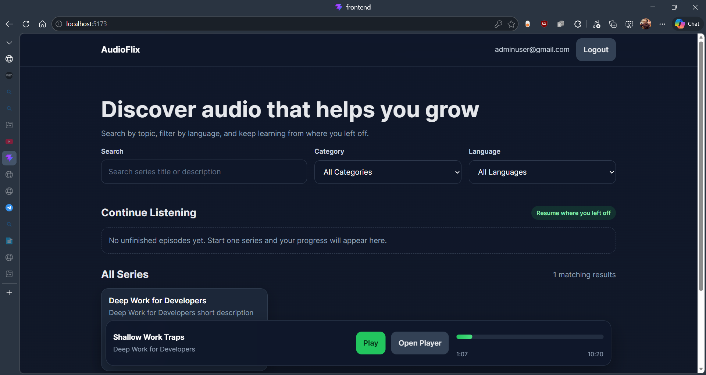
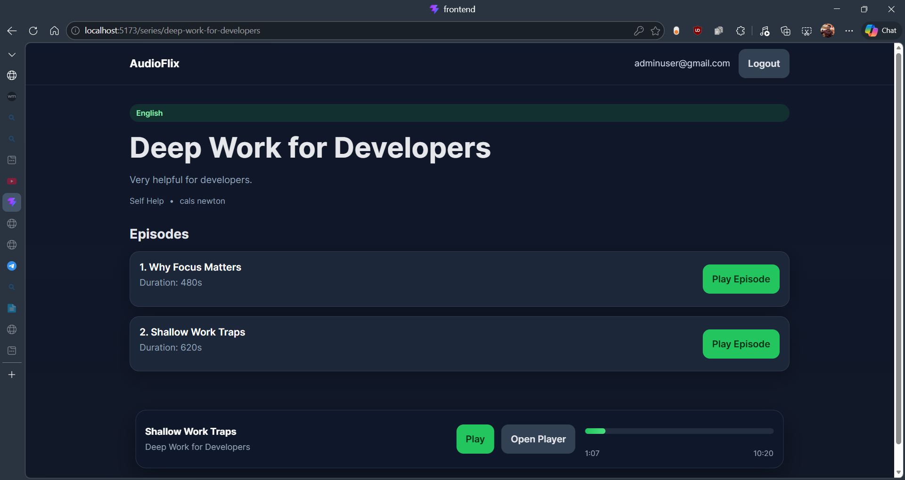
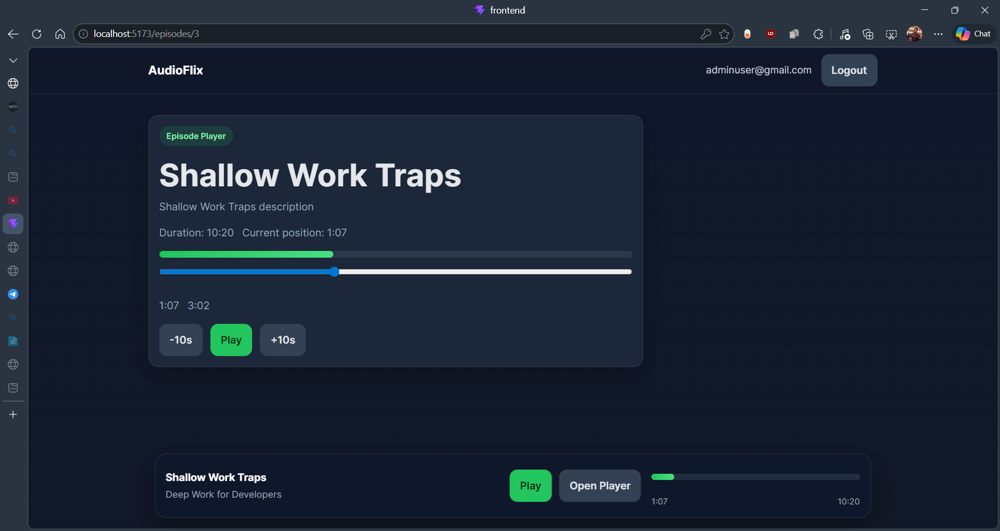
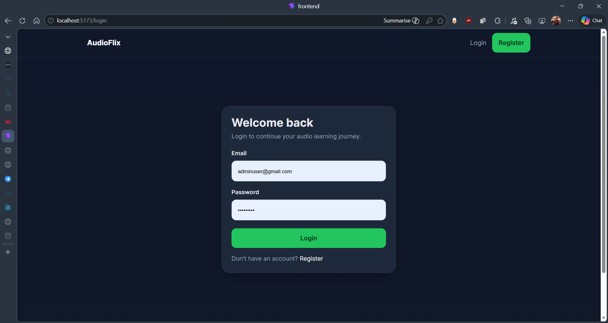

# KukuFM Mini Audio Platform

A full-stack mini audio streaming platform inspired by apps like KukuFM, built with **React + Django REST Framework**.

This project allows users to browse audio series, open episode details, play audio, pause playback, resume from saved progress, and continue listening from where they left off. It is being built as a portfolio-ready full-stack product to showcase backend API design, frontend state management, authentication, and media playback flows.

## Features

### Implemented
- User authentication
- Browse published audio series
- View series details and episode lists
- Open an episode player page
- Play and pause audio episodes
- Save listening progress
- Resume from saved position
- Continue listening section
- Global audio player context
- Mini-player UI

### In Progress
- Logout fix
- Better mini-player interactions
- Seek controls polish
- UI improvements
- README screenshots
- Deployment

### Planned
- YouTube episode support as a future version
- Admin-side audio upload support
- Search and filtering enhancements
- Better player controls
- Recently played and recommendations
- Testing
- Deployment

## Tech Stack

### Frontend
- React
- React Router
- Axios
- Context API
- CSS

### Backend
- Django
- Django REST Framework
- PostgreSQL

## Project Structure

```bash
kukufm-mini-audio-platform/
├── backend/
│   ├── accounts/
│   ├── content/
│   ├── listening/
│   ├── config/
│   └── manage.py
├── frontend/
│   ├── src/
│   │   ├── api/
│   │   ├── components/
│   │   ├── context/
│   │   ├── pages/
│   │   └── ...
│   └── package.json
└── README.md
```

## Core Modules

### 1. Content
Handles:
- categories
- languages
- series
- episodes

### 2. Listening
Handles:
- listening progress per user
- continue listening feed
- completion logic

### 3. Frontend Player
Handles:
- current active episode
- global audio playback
- pause/play state
- resume support
- progress updates to backend

## Current User Flow

1. User logs in.
2. User browses available series.
3. User opens a series detail page.
4. User selects an episode.
5. Audio starts playing using a direct MP3 URL.
6. Progress is saved periodically.
7. User can return later and continue listening.

## Local Setup

### 1. Clone the repository
```bash
git clone https://github.com/vishnuwebz/kukufm-mini-audio-platform.git
cd kukufm-mini-audio-platform
```

### 2. Backend setup
```bash
cd backend
python -m venv venv
```

Activate the virtual environment:

#### Windows
```bash
venv\Scripts\activate
```

#### macOS / Linux
```bash
source venv/bin/activate
```

Install dependencies:
```bash
pip install -r requirements.txt
```

Create a `.env` file if your backend uses environment variables.

Run migrations:
```bash
python manage.py makemigrations
python manage.py migrate
```

Create a superuser:
```bash
python manage.py createsuperuser
```

Start backend server:
```bash
python manage.py runserver
```

### 3. Frontend setup
Open a new terminal:

```bash
cd frontend
npm install
npm run dev
```

## Sample Audio for Development

For development, the current player uses direct MP3 URLs instead of YouTube links. Example test audio:

```text
https://www.learningcontainer.com/wp-content/uploads/2020/02/Kalimba.mp3
```

This works with the native HTML audio player flow used in the current version of the app.

## API Overview

### Content
- `GET /content/series/`
- `GET /content/series/<slug>/`
- `GET /content/episodes/<id>/`

### Listening
- `POST /listening/progress/`
- `GET /listening/continue-listening/`

### Auth
- Auth endpoints are available for login and protected routes depending on current backend setup.

## Screenshots

<table>
  <tr>
    <td></td>
    <td></td>
  </tr>
  <tr>
    <td align="center">Home Page</td>
    <td align="center">Series Detail Page</td>
  </tr>
  <tr>
    <td></td>
    <td></td>
  </tr>
  <tr>
    <td align="center">Episode Player Page</td>
    <td align="center">Login Page</td>
  </tr>
</table>


## Why I Built This

I built this project to strengthen my full-stack development skills with a real product-style use case instead of a basic CRUD app.

This project helped me practice:
- Django REST API design
- React state management
- authenticated API flows
- media playback handling
- progress persistence
- feature-oriented project structuring

## Challenges Solved

- Managing a global audio player across pages
- Persisting listening progress to the backend
- Restoring resume position for episodes
- Structuring content models for series and episodes
- Connecting frontend playback state with backend listening APIs

## Roadmap

- Fix logout flow
- Improve mini-player UX
- Add polished seek controls
- Add better empty states and loading states
- Add tests
- Add deployment
- Add future support for alternative media types like YouTube embeds

## Notes

- The current version supports **direct audio URLs**.
- YouTube support is intentionally postponed for a later version.
- This repository is being built in public as part of my portfolio.

## Author

**Vishnu**
- GitHub: [vishnuwebz](https://github.com/vishnuwebz)

## License

This project is for learning, portfolio, and demonstration purposes.